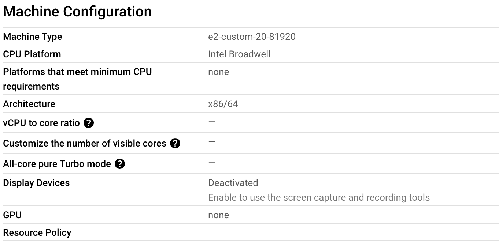
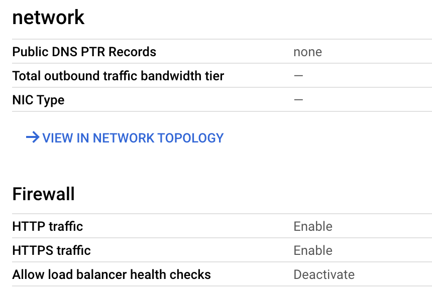
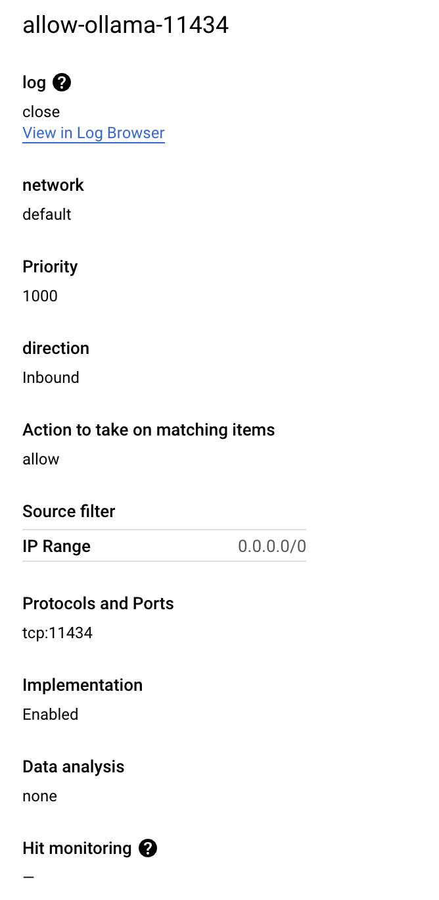
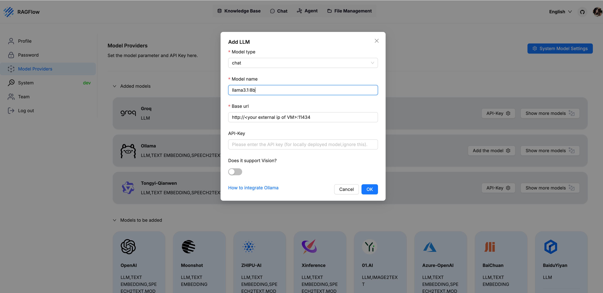

# ragflow-google-cloud-setup
Guide to Installing Ragflow on Google Cloud Compute Engine
# Installing Ragflow on Google Cloud Compute Engine

This guide walks you through the process of setting up Ragflow on a Google Cloud Compute Engine virtual machine (VM). It covers deploying the llama3.1:70b model using Ollama on the VM and configuring Ragflow to work with locally deployed models.

## Prerequisites

- **Google Cloud Account**: Ensure you have access to Google Cloud and the Compute Engine service. New accounts typically come with approximately $440 in free credits.
- **Compute Engine Setup**: You'll need a VM with at least 4 CPUs (equivalent to 8 vCPUs), 16 GB of memory, and 50 GB of disk space to run Ragflow. If you're planning to run the llama3.1:70b model, I recommend using about 80 GB of memory and 10 cores (20 vCPUs), as the model requires at least 40 GB of memory. You'll also need around 100 GB of storage (since llama3.1:70b itself is around 40 GB), though these settings can be adjusted later.
- **Docker**: Docker needs to be installed on the VM to run Ragflow.

## Steps

### 1. Set Up Google Cloud Compute Engine

<<<<<<< HEAD
- **Create a new VM instance** in the Google Cloud Console. Choose a machine type with the required resources (e.g., n2-standard-4).
- **Configure firewall rules** to allow traffic on the necessary ports (e.g., 11434 for Ollama).

### 2. Install Docker on the VM

SSH into your VM and run the following commands to install Docker:

```bash
sudo apt-get update
sudo apt-get install -y docker.io
sudo systemctl start docker
sudo systemctl enable docker
=======
- **Create a new VM instance** in the Google Cloud Console. Choose a machine type with the required resources (e.g., E2). It is recommended to use Linux Ubuntu as the operating system.


- **Configure firewall rules** to allow traffic on the necessary ports (e.g., 11434 for Ollama).

### 2. Install Docker on the VM
ou can follow the official Docker installation guide for Ubuntu from this link: https://docs.docker.com/engine/install/ubuntu/
SSH into your VM and run the following commands to install Docker:
1. Set up Docker's apt repository.
```bash
# Add Docker's official GPG key:
sudo apt-get update
sudo apt-get install ca-certificates curl
sudo install -m 0755 -d /etc/apt/keyrings
sudo curl -fsSL https://download.docker.com/linux/ubuntu/gpg -o /etc/apt/keyrings/docker.asc
sudo chmod a+r /etc/apt/keyrings/docker.asc

# Add the repository to Apt sources:
echo \
  "deb [arch=$(dpkg --print-architecture) signed-by=/etc/apt/keyrings/docker.asc] https://download.docker.com/linux/ubuntu \
  $(. /etc/os-release && echo "$VERSION_CODENAME") stable" | \
  sudo tee /etc/apt/sources.list.d/docker.list > /dev/null
sudo apt-get update
```
2. Install the Docker packages.
```bash
sudo apt-get install docker-ce docker-ce-cli containerd.io docker-buildx-plugin docker-compose-plugin
```
3. Verify that the Docker Engine installation is successful by running the hello-world image.
```bash
sudo docker run hello-world
```
This command downloads a test image and runs it in a container. When the container runs, it prints a confirmation message and exits.
### 3. Run Ragflow in Docker in VM
You can follow the **Quick Start** guide provided in the [Ragflow GitHub repository](https://github.com/infiniflow/ragflow/blob/main/README.md).

1. Ensure `vm.max_map_count` is set to at least 262144:

To check the current value of `vm.max_map_count`:
```bash
sysctl vm.max_map_count
```
Reset vm.max_map_count to a value at least 262144 if it is not.
```bash
# In this case, we set it to 262144:
sudo sysctl -w vm.max_map_count=262144
```
This change will be reset after a system reboot. To ensure your change remains permanent, add or update the vm.max_map_count value in /etc/sysctl.conf accordingly:
Open the /etc/sysctl.conf file using nano or any text editor:
```bash
sudo nano /etc/sysctl.conf
```
Scroll down to find the vm.max_map_count setting, or if it doesn't exist, add the following line at the end of the file:
```bash
vm.max_map_count=262144
```
Save the file:
For nano: Press Ctrl + O to save the changes, then press Enter.
Exit the editor by pressing Ctrl + X.
2. Clone the repo
```bash
git clone https://github.com/infiniflow/ragflow.git
```
3. Build the pre-built Docker images and start up the server
```bash
cd ragflow/docker
chmod +x ./entrypoint.sh
docker compose up -d
```
4. Check the server status after having the server up and running:
```bash
docker logs -f ragflow-server
```
### 4. Open ragflow webpage using your vm ip
To find your VM’s external IP address, go to the Virtual Machine Instances homepage in Google Cloud. Once you have the IP, open the Ragflow webpage by entering http://<your-vm-external-ip>:80 in your browser.
### 5. Deploy LLaMA Model with Ollama in VM
1. Install Ollama on the VM:
```bash
sudo docker pull ollama/ollama
sudo docker run -d -p 11434:11434 --name ollama-container ollama/ollama
```
2. Download the llama3.1:70b model:
```bash
sudo docker exec -it ollama-container /bin/bash
```
At this point, you will be inside the root directory of the ollama-container. You can simply run the model by using the command ollama run <model-name>. If the model is not found locally, Ollama will automatically pull the image and download it for you
```bash
ollama run llama3.1:70b
```
You can use the following command to check the list of models available:
```bash
ollama list 
```
### 6. Add the Model to Ragflow
Open the Ragflow UI:
Access the Ragflow user interface by entering the following URL into your browser: http://<your external ip>:80.
Make sure to replace <your external ip> with the actual external IP address of your VM, which you can find in the Google Cloud Console under Virtual Machine Instances.
Navigate to Model Providers:
Once in the UI, navigate to Model Providers. This is where you will configure the model that Ragflow will use for chat and other functions.
Add the Ollama Model:
In the Model Providers section, select Ollama as the provider.
Enter the model name exactly as it appears from the model you downloaded (e.g., llama3.1:70b). This name must match the model you have pulled and downloaded in the Ollama container.
Configure the URL:
In the URL field, input the following: 
```bash
http://<your external ip>:11434
```
Replace <your external ip> with the actual IP of your VM, and ensure the port is set to 11434, which is the port exposed by the Ollama container.

>>>>>>> f88c79d (add README.md)
